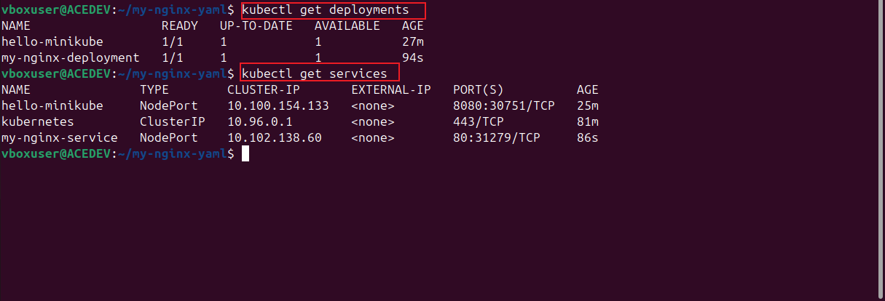

# kubernetes-Resources
 Learning Kubernetes, specifically working with YAML files to define Kubernetes resources. It provides an introduction to YAML syntax, including its structure, data types, comments, and key features like anchors and aliases.

The project also covers deploying applications in Kubernetes using Minikube, explaining the role of Deployments and Services. It outlines different Kubernetes service types—ClusterIP, NodePort, and LoadBalancer—along with examples of deploying and exposing applications using kubectl commands.

Additionally, it walks through creating a deployment YAML file for an Nginx server, defining key components such as metadata, replicas, selectors, and containers. A corresponding service YAML file is introduced to expose the deployment externally. Finally, commands to apply and verify the deployment on Kubernetes are provided.

# STEP 1: 
* Deploying a minikube sample application 

 Create a kuberentes deployment named "hello-minikube" running the "kickbase/echo-server:1.0" container image

      kubectl create deployment hello-minikube --image=kicbase/echo-server:1.0

* expose the created deployment "hello-minikube" as a nodeport service on port 8080

      kubectl expose deployment hello-minikube --type=NodePort --port=8080

* list the services :

      kubectl get services hello-minikube

# STEP 2 : WORKING WITH YAML FILES

* Create a new folder "my-nginx-yaml" 

      mkdir my-nginx-yaml

* using nano create a new file "nginx-deployment.yaml" and input the script:

      nano nginx-deployment.yaml

 script:     

      apiVersion: apps/v1
      kind: Deployment
      metadata:
          name: my-nginx-deployment
      spec:
        replicas: 1
       selector:
          matchLabels:
            app: my-nginx
       template:
        metadata:
          labels:
            app: my-nginx
      spec:
      containers:
      - name: my-nginx
        image: dareyregistry/my-nginx:1.0
        ports:
        - containerPort: 80

   
   

* Created another file "nginx-service.yaml" and pasted the script :
    
       nano nginx-service.yaml

script :

    apiVersion: v1
    kind: Service
    metadata:
       name: my-nginx-service
    spec:
      selector:
        app: my-nginx
    ports:
    - protocol: TCP
      port: 80
      targetPort: 80
    type: NodePort

# STEP 3 : DEPLOYMENT OF CLUSTER

* Running the command below :

      kubectl apply -f nginx-deployment.yaml

      kubectl apply -f nginx-service.yaml

* Verify deployment :
   
      kubectl get deployments

      kubectl get services

* Access deployment on web browser:
     
      minikube service my-nginx-service --url

* copy url "http://192.168.49.2:31279" and paste on browser
